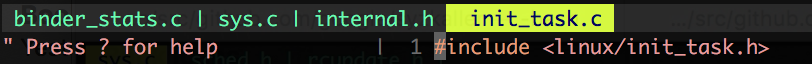
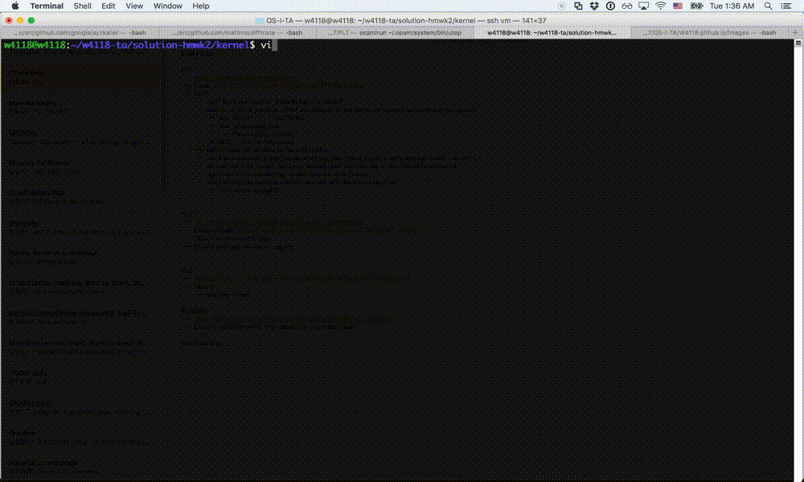

# Using Vim and cscope for development

## Introduction

Most of this guide is dedicated to building out a robust Vim developer environment. If you are not planning to use Vim for this class, feel free to jump straight to the section on [Cscope](#cscope). Cscope is useful even if you are using other text editors, because it provides code browsing functionality.

**Non-Vim users**: If you have a cool Emacs/Atom/etc setup, feel free to send us a guide and we will share it on the course website.

**VS Code**: Apart from classical editors like Vim/Emacs/Atom/Sublime, VS Code is a lot more popular nowadays, and it provides a lot of the same functionality (with far simpler setup). For more information, see [here](https://code.visualstudio.com/docs).

## Installation

First install some dependencies:

```
$ sudo apt install vim-gtk3 clang cmake curl python3 python3-dev
```

We install `vim-gtk3` over the default Vim package because the default version is not compiled with python support, which is needed for the [`YouCompleteMe`](https://github.com/ycm-core/YouCompleteMe/) plugin later. (Don’t worry if you have already installed a different Vim package before, `vim-gtk3` will take priority over it.)

## The philosophy of Vim

One critical point about working in Vim is: **don’t use Vim tabs**! Instead, use **buffers** and **windows**.

People who are most familiar with other IDEs like Sublime/Atom generally expect to use tabs with Vim, because that is how these other editors work: the relationship is 1 tab per 1 file, and opening/closing a file requires opening/closing a tab. Vim however is not meant to be used this way–it was designed to work within a single terminal tab by utilizing multiple windows + multiple buffers.

Definitions:

- A **Buffer** is simply the raw data associated with an open file.
- A **Window** is a visual display for a buffer. A tab in Vim must have >= 1 window, and each window displays exactly 1 buffer.
- A **Tab** is a layout of windows, a viewport onto buffers.

Here is an approximate translation from actions in Sublime –> actions in Vim:

- Open `file.c` in a new tab –> Open `file.c` in a new buffer, and move your window to display this buffer
- Close tab of `file.c` –> Close the `file.c` buffer
- Open `file.c` in a new column –> Open `file.c` in a new window with either `:vsp file.c` or `:sp file.c`
- etc.

Here’s an example of what this should look like. Note that we never open a new tab. Instead, we have 3 buffers open and 1 or 2 windows open. To view a file, we simply navigate the window we want to the appropriate buffer.


## Install Vim-Plug

Now let’s get to installing plugins.

[`vim-plug`](https://github.com/junegunn/vim-plug) is a plugin manager for Vim. There are other plugin managers out there but we’ll be using `vim-plug` to install the remaining plugins, so do this first! To use `vim-plug`, add the following to your `~/.vimrc`:

```
" automatically downloads vim-plug to your machine if not found.
if empty(glob('~/.vim/autoload/plug.vim'))
    silent !curl -fLo ~/.vim/autoload/plug.vim --create-dirs
    \ https://raw.githubusercontent.com/junegunn/vim-plug/master/plug.vim
    autocmd VimEnter * PlugInstall --sync | source $MYVIMRC
endif

" Define plugins to install
call plug#begin('~/.vim/plugged')

" List your plugins here, for instance:
" Plug 'tpope/vim-sensible'

" All of your Plugins must be added before the following line
call plug#end()
```

To install the plugins currently listed in your `.vimrc`, open Vim and run:

```
:PlugInstall
```

As always, use `:q` to exit the plugin screen and return to your editor. Now all plugins will be installed inside `~/.vim/plugged` and they will be automatically added to your Vim runtimepath.

## Remapping Leader

Vim has the concept of a "leader" key, which is used to program personal keyboard shortcuts. By default, it is mapped to `\`, which is a little difficult to reach. We suggest mapping it to either `space` or comma `,`. In your ~/.vimrc, write either:

```
let mapleader ="\<Space>"
```

or

```
let mapleader = ","
```

We will be using leader keys through the rest of the guide. When you see something like `nmap <leader>l :bnext<CR>`, it means we are mapping the keyboard shortcut `<leader> + l` to the action `:bnext<CR>`.

## Bufferline display

[`Airline`](https://github.com/vim-airline/vim-airline) is a package to display status information such as your current git branch and what buffer you are currently viewing. Add this plugin to your `~/.vimrc`:

```
" Define plugins to install
call plug#begin('~/.vim/plugged')

Plug 'vim-airline/vim-airline'

" Optional
Plug 'vim-airline/vim-airline-themes'

" All of your Plugins must be added before the following line
call plug#end()
```

And in your `~/.vimrc` also add:

```
" Airline
let g:airline#extensions#tabline#enabled = 1 " Enable the list of buffers
let g:airline#extensions#tabline#fnamemod = ':t' " Show just the filename
```

When it’s all done, you should have a header that looks like:



To easily maneuver around these buffers, add this to your ~/.vimrc:

```
" -----------Buffer Management---------------
set hidden " Allow buffers to be hidden if you've modified a buffer

" Move to the next buffer
nmap <leader>l :bnext<CR>

" Move to the previous buffer
nmap <leader>h :bprevious<CR>

" Close the current buffer and move to the previous one
" This replicates the idea of closing a tab
nmap <leader>q :bp <BAR> bd #<CR>

" Show all open buffers and their status
nmap <leader>bl :ls<CR>
```

Now to navigate your window left/right between buffers, just press `<leader> + h` or `<leader> + l`. To close a buffer, press `<leader> + q`.

## Window navigation

To open a new window, enter:

- `:vsp` to open a vertically-split window
- `:sp` to open a horizontally-split window

You can also use `Ctrl-w + s` or `+ v` to make a horizontal or vertical split, respectively.

To navigate between windows, use `Ctrl-w + h/j/k/l` to navigate left/down/up/right.

Alternatively, add this to your `~/.vimrc` so that you can move between windows using arrow keys:

```
" Use arrow keys to navigate window splits
nnoremap <silent> <Right> :wincmd l <CR>
nnoremap <silent> <Left> :wincmd h <CR>
noremap <silent> <Up> :wincmd k <CR>
noremap <silent> <Down> :wincmd j <CR>
```

To close a window, press `Ctrl-w + c`.

## Ctrl-p and Nerdtree

The Linux kernel is a massive code base, so for easy navigation we’ll want to add a filename grepper ([`ctrl-p`](https://github.com/kien/ctrlp.vim)) and file tree ([`Nerdtree`](https://github.com/preservim/nerdtree)):

```
" Define plugins to install
call plug#begin('~/.vim/plugged')

" Browse the file system
Plug 'scrooloose/nerdtree'

" Ctrlp
Plug 'ctrlpvim/ctrlp.vim'

" All of your Plugins must be added before the following line
call plug#end()
```

Now add the following to your `~/.vimrc`:

```
" ctrl-p
let g:ctrlp_custom_ignore = {
    \ 'dir':  '\v[\/](\.(git|hg|svn)|\_site)$',
    \ 'file': '\v\.(exe|so|dll|class|png|jpg|jpeg)$',
\}

" Use the nearest .git|.svn|.hg|.bzr directory as the cwd
let g:ctrlp_working_path_mode = 'r'
nmap <leader>p :CtrlP<cr>  " enter file search mode

" Nerdtree
autocmd StdinReadPre * let s:std_in=1
autocmd VimEnter * if argc() == 0 && !exists("s:std_in") | NERDTree | endif
autocmd bufenter * if (winnr("$") == 1 && exists("b:NERDTree") && b:NERDTree.isTabTree()) | q | endif
map <C-n> :NERDTreeToggle<CR>  " open and close file tree
nmap <leader>n :NERDTreeFind<CR>  " open current buffer in file tree
```

Now if you want to search for and open a file, press `<leader> + p`. This is analogous to `Cmd-r` in Sublime.

Nerdtree will show a file tree in the window on the left of your screen. To collapse/expand it, press `Ctrl-n`. To expose your current working file in the file tree, press `<leader> + n`.

Altogether it looks like this:



## YCM

Next we are going to add semantic auto-complete through a plugin called [`YouCompleteMe`](https://github.com/ycm-core/YouCompleteMe/). This part is a little involved, so here’s a demo first so you can decide if it’s worth the setup:


Firstly, install YCM:

```
" Define plugins to install
call plug#begin('~/.vim/plugged')

" YCM
Plug 'Valloric/YouCompleteMe'

" All of your Plugins must be added before the following line
call plug#end()
```

Then:

```
$ cd ~/.vim/plugged/YouCompleteMe
$ git submodule update --init --recursive
$ ./install.py --clangd-completer
```

And add the following to your `~/.vimrc`:

```
" Modify below if you want less invasive semantic auto-complete
let g:ycm_semantic_triggers = {
    \   'c' : ['->', '.'],
    \   'objc' : ['->', '.'],
    \   'cpp,objcpp' : ['->', '.', '::'],
    \   'perl' : ['->'],
    \ }

let g:ycm_complete_in_comments_and_strings = 1
let g:ycm_key_list_select_completion = ['<C-n>', '<Down>']
let g:ycm_key_list_previous_completion = ['<C-p>', '<Up>']
let g:ycm_autoclose_preview_window_after_completion = 1

set completeopt-=preview

" Optionally suppress all error messages generated by YCM:
" let g:ycm_show_diagnostics_ui=0

" Optionally remove automatic identifier-based completion:
" let g:ycm_min_num_of_chars_for_completion = 99
```

YCM utilizes `clangd`, a language server that performs semantic auto-complete (along with plenty of other features). We have to provide `clangd` with a `compile_commands.json` file, which specifies the simulated compilation flags clangd should use when analyzing your code. Luckily, Linux provides a script to generate this file (for projects that do not have such a script, see `compiledb` and/or `bear`):

```
$ cd <path-to-homework-assignment>/linux
$ make      # Only need to do this if you haven't built the kernel yet
$ scripts/clang-tools/gen_compile_commands.py
```

YCM will automatically detect any `compile_commands.json` files on startup, so this is the final step! Semantic auto-complete will now show up when trying to access the elements of any structs/unions (by using `.` or `->`). You can also manually trigger semantic auto-complete by pressing `Ctrl+Space`.

One other useful feature clangd supports is `GOTOs`. For convenience, you can add one more mapping to your `~/.vimrc`:

```
" Map GoTo functionality
nmap <leader>] :YcmCompleter GoTo<CR>
```

Now, when your cursor is over any function call, macro, or header file, enter this mapped key combination and you will automatically jump to the relevant declaration or file in a new buffer!


**Important Note**: for YCM in the kernel to work properly you need to be inside the kernel when you activate Vim, e.g.

```
$ cd <path-to-homework-assignment>/linux && vim
```

**Optional**: If you chose not to suppress all warning messages, YCM will likely throw multiple error messages at the beginning of each document referring to an `Unknown argument` or `Unsupported option`. These warnings will not affect YCM’s functionality; however, if you would like to suppress these error messages you may create a file at `~/.config/clangd/config.yaml` and write:

```
CompileFlags:
  Remove: [ -mpreferred-stack-boundary=*, -mindirect-branch*,
            -fno-allow-store-data-races, -fconserve-stack, -mrecord-mcount,
            -mfunction-return=*, -mskip-rax-setup, -mno-fp-ret-in-387,
            -mno-var-tracking-assignments, -femit-struct-debug-baseonly,
            -mabi=lp64 ]
```

You may add any other compiler flags that show up as an error to this list as you need.

## Cscope

This is the final step: Efficiently browsing code.

[Cscope](https://cscope.sourceforge.net/) is a code browser that works in your terminal and within Vim. It is far more powerful than a standard grepper (such as the one at elixir). For example, Cscope can answer:

* Where is this variable used?
* What is the value of this preprocessor symbol?
* Where is this function in the source files?
* What functions call this function?
* What functions are called by this function?
* Where does the message “out of space” come from?
* Where is this source file in the directory structure?
* What files include this header file?

To install on Ubuntu:

```
$ sudo apt install cscope
```

Verify installation succeeded by running `cscope`. This should open up the Cscope browser in your terminal window. To exit, use `Ctrl-d`.

To use Cscope, you will need to first build the Cscope database for a given codebase. In the top-level directory of the linux kernel, this can be done via:

```
$ cd <path-to-homework-assignment>/linux
$ make cscope
```

This will generate `cscope.files`, which lists all kernel files Cscope will include in its project database. Then do:

```
$ cscope -b -q -k
```

This builds the Cscope db, which comprises three files: `cscope.files`, `cscope.in.out`, and `cscope.out`. Do not touch these!

If you do accidentally delete them, run `cscope -b -q -k` in the root of your kernel source tree to regenerate them.

To use the Cscope browser:

```
$ cd <path-to-homework-assignment>/linux
$ cscope -d
```

Use `Tab` to alternate between the menu and the list of matching lines. See the [manpage](https://cscope.sourceforge.net/cscope_man_page.html) or type `?` in the Cscope browser to learn more.

Demo:


We recommend using 2 terminal windows when working: one dedicated to Vim/writing code, and the other dedicated to Cscope/browsing code.

## Fin

And that completes this developer workflow guide. Congrats if you’ve made it this far; hopefully the time spent reading this will be vastly outweighed by time you’ll have saved in this class and beyond.

You can also take a look at an example `~/.vimrc` from Howon (a past TA) [here](https://github.com/Howon/Config/blob/master/vimrc).
