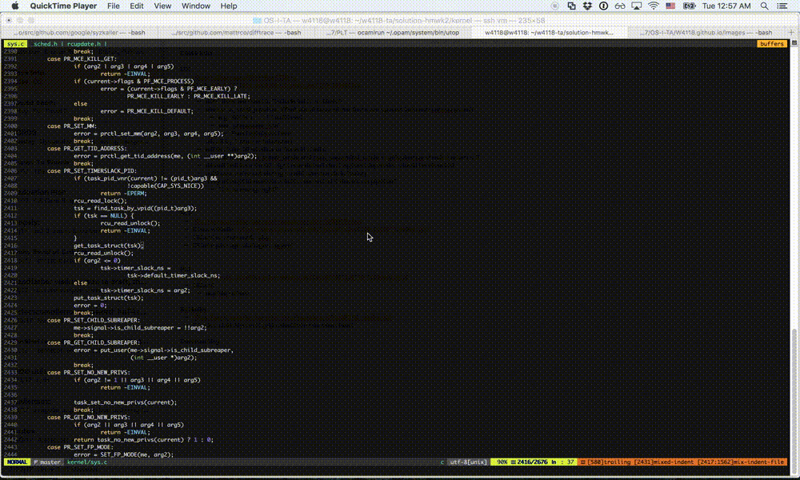
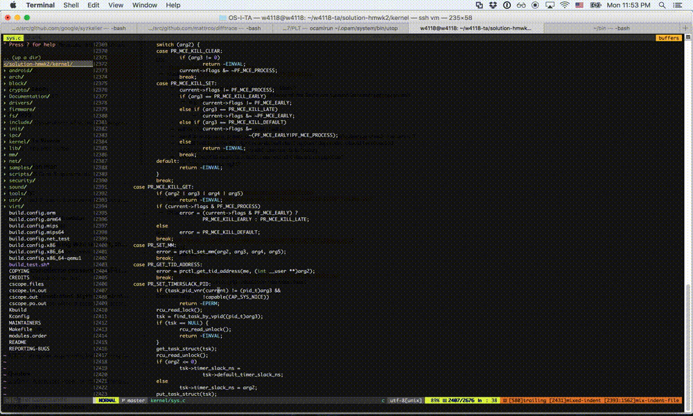

# OS Developer Workflow

From now on, all assignments will need to be done in the class VM, and will involve working within a complete copy of the Linux Kernel. After hearing the frustrations of students in past years who have tried to do their assignments directly in the VMWare console, using a barebones text editor, we have created a guide for building out an improved developer workflow. We present instructions for how to configure remote ssh, set up git shortcuts, and configure a robust Vim dev environment.

By the end of this guide, you will be able to:

 - Use `ssh` to work directly in your host OS
 - Have semantic auto-complete, file grepping, function GOTOs and more in your vim
 - Impress non-OS friends with your vim wizardry


## SSH into vm

Most students are more comfortable working in their host machine than in the VM. We can enable this by configuring remote ssh.

First, in your VM execute the following command to get its remote address:
`/sbin/ifconfig eth0 | grep 'inet addr' | awk '{print $2}' | cut -d ':' -f 2`

Copy the address and in the `~/.ssh/config` file on your __host machine__, add:

```
Host vm
  HostName <YOUR-VM-ADDRESS>
  User w4118
```

Now, to ssh into your VM just type `ssh vm`.

__For the remainder of this guide, all changes will be made in the class virtual machine.__

## Gitconfigs:

To optimize your git workflow, you can add shortcuts to the   `~/.gitconfig` file on your VM. For example, here is my config file:

```
[user]
	  name = Andrew Aday
    email = aza2112@columbia.edu
[color]
    diff = auto
    status = auto
    branch = auto
[core]
    editor = vim
[alias]
    stash-unapply = !git stash show -p | git apply -R
    co = checkout
    br = branch
    ci = commit
    st = status
    last = log -1 HEAD
    plog = log --pretty=oneline --abbrev-commit
    conflict = diff --name-only --diff-filter=U  # View all files that have merge conflicts
```


# Vim Setup

__Non-vim users__: If you have a cool emacs/atom/etc setup, feel free to send us a guide and we will share it on the course website.

The remainder of this guide will be dedicated to building out a robust vim developer environment, so only continue if are planning to use vim for this class.

## The Philosophy of Vim

Before diving into setup, I need to assert a critical point about working in vim: __don't use tabs__! Instead, use __buffers__ and __windows__.

Many of you taking this class have come fresh out of AP, where you first learned to use vim. When I took OS I was in the same boat; all I had with me was Jae's `.vimrc`, a few keyboard shortcuts, and many bad habits. Unfortunately, no class really teaches *how* to use vim, and as a result its easy to become glued to functional, but inefficient methods.
For instance, if you repeatedly type `:tabn`/`:tabp` to navigate files, or if you have 10 different terminal windows open, each ssh'd to the same remote directory with 10 instances of vim open on 10 different files (aka me in AP)...your workflow is probably suboptimal.

Thus, beyond installing plugins, the aim of this guide is to enforce efficient vim usage patterns that will save you tremendous amounts of time in the long run.

People who are most familiar with IDEs or sublime/atom expect to use tabs with vim because that is how these other editors work: the relationship is 1 tab per 1 file, and opening/closing a file requires opening/closing a tab. Vim however is not meant to be used this way--it was designed to work within a *single* terminal tab by utilizing multiple windows + multiple buffers.

Definitions:
- A __Buffer__ is simply the raw data associated with an open file.
- A __Window__ is a visual display for a buffer. A tab in Vim must have >= 1 window, and each window displays exactly 1 buffer.

Here is an approximate translation from actions in sublime --> actions in vim:

- Open `file.c` in a new tab --> Open `file.c` in a new buffer, and move your window to display this buffer
- Close tab of `file.c` --> Close the `file.c` buffer
- Open `file.c` in a new column --> Open `file.c` in a new window with either `:vsp file.c` or `:sp file.c`
- etc.

Here's an example of what this should look like. Note that I never open a new tab. Instead, I have 3 buffers open (top line) and 1 or 2 windows open. To view a file, I simply navigate the window I want to the appropriate buffer.



## Install Pathogen

[Pathogen](https://github.com/tpope/vim-pathogen) is a plugin manager for Vim. We'll be using pathogen to install the remaining plugins, so do this first!

### Remapping <Leader>


## Window navigation
ctrl-w + c
ctrl-w + h|j|k|l

```
" Use arrow keys to navigate window splits
nnoremap <silent> <Right> :wincmd l <CR>
nnoremap <silent> <Left> :wincmd h <CR>
noremap <silent> <Up> :wincmd k <CR>
noremap <silent> <Down> :wincmd j <CR>
```

## Bufferline Display:
`git clone https://github.com/vim-airline/vim-airline ~/.vim/bundle/vim-airline`

## Buffergator
` git clone https://github.com/jeetsukumaran/vim-buffergator ~/.vim/bundle/vim-buffergator`
s/S vertical split
i/I horizontal split
<leader>[right|left|up|down]arrow to open a verticle or horizontal split window

## ctrl-p

`git clone https://github.com/ctrlpvim/ctrlp.vim ~/.vim/bundle/vim-ctrlp`


## syntastic

`git clone --depth=1 https://github.com/vim-syntastic/syntastic.git ~/.vim/bundle/vim-ctrlp`


## YCM
update vim!
https://github.com/Valloric/YouCompleteMe/wiki/Building-Vim-from-source
```
sudo apt-get install libncurses5-dev libgnome2-dev libgnomeui-dev \
    libgtk2.0-dev libatk1.0-dev libbonoboui2-dev \
    libcairo2-dev libx11-dev libxpm-dev libxt-dev python-dev \
    python3-dev ruby-dev lua5.1 lua5.1-dev libperl-dev git
```

```
sudo apt-get remove vim vim-runtime gvim
```

Install python2 to enable building vim with python support
```
sudo apt-get install python python-dev
```

```
cd ~
git clone https://github.com/vim/vim.git
cd vim
./configure --with-features=huge \
            --enable-multibyte \
            --enable-rubyinterp=yes \
            --enable-pythoninterp=yes \
            --with-python-config-dir=/usr/lib/python2.7/config \
            --enable-perlinterp=yes \
            --enable-luainterp=yes \
            --enable-gui=gtk2 \
            --enable-cscope \
            --prefix=/usr/local
make VIMRUNTIMEDIR=/usr/local/share/vim/vim80
sudo make install
```
Now set vim as default editor:
```
sudo update-alternatives --install /usr/bin/editor editor /usr/local/bin/vim 1
sudo update-alternatives --set editor /usr/local/bin/vim
sudo update-alternatives --install /usr/bin/vi vi /usr/local/bin/vim 1
sudo update-alternatives --set vi /usr/local/bin/vim
```

Install YCM
```
cd ~/.vim/bundle
git clone https://github.com/Valloric/YouCompleteMe.git
cd YouCompleteMe
git submodule update --init --recursive
`./install.py --clang-completer`
```

Now install clang
`sudo apt-get update && sudo apt-get install clang`

note: do we need to install libclang?

Now install YCM_generator: https://github.com/rdnetto/YCM-Generator
To get the appropriate ycm conf file, run `~/.vim/bundle/YCM-Generator/config_gen.py PROJECT_DIRECTORY`, where PROJECT_DIRECTORY contains the root makefile of your C project.


TODO: add ycm_extra_conf files and vimrc configs

Note: for YCM in the kernel to work properly you need to be *inside* the kernel directory.
e.g. `cd <path-to-homework-assignment>/kernel && vim`


To move cursor around: ctrl-O and ctrl-I


## Cscope

Cscope is a code browser that works in your terminal and within vim. It is far more powerful than a standard grepper (such as the one at http://elixir.free-electrons.com/linux/v3.10/). For example, Cscope can answer:

- Where is this variable used?
- What is the value of this preprocessor symbol?
- Where is this function in the source files?
- What functions call this function?
- What functions are called by this function?
- Where does the message "out of space" come from?
- Where is this source file in the directory structure?
- What files include this header file?

To install Cscope, we need to build from source. First, download the latest stable version:

```
cd ~ && wget https://sourceforge.net/projects/cscope/files/cscope/15.8a/cscope-15.8a.tar.gz/download -O cscope-15.8a.tar.gz
tar xvzf cscope-15.8a.tar.gz
```

To install, `cd cscope-15.8a` and run
```
./configure
make
sudo make install
```

Verify installation succeeded by running `cscope`. This should open up the Cscope browser in your terminal window. To exit, use `ctrl-d`.

In the template code for all your written assignments, we will include the following files in `<PATH-TO-HW-REPO>/kernel`:

- `cscope.files`: lists all kernel files Cscope will include in its project database
- `cscope.files`, `cscope.in.out`, `cscope.out`: Files comprising the Cscope database. Do not touch these!
  - If you do accidentally delete them, run `cscope -b -q -k` in the kernel directory to regenerate.

TODO: insert demo video.

Use `<Tab>` to alternate between the menu and the list of matching lines. See [manpage](http://cscope.sourceforge.net/cscope_man_page.html) for more usage instructions of the Cscope browser.

To enable vim support, we need to add a new `cscope_maps.vim` file. First, if it doesn't already exist, `mkdir ~/.vim/plugin/`. All `.vim` files in this directory will automatically be sourced into your `~/.vimrc`. Then run:

```
cd ~/.vim/plugin && wget http://cscope.sourceforge.net/cscope_maps.vim
```

See this [tutorial](http://cscope.sourceforge.net/cscope_vim_tutorial.html) for more usage details. For now, I will tell you the single most useful feature we have just added: __Function GOTOs__! Now, when your cursor is over a function call, enter `ctrl + ]` and you will automatically jump to the function declaration in a new buffer. And to move your cursor back and forth, use `ctrl + o` (backwards) and `ctrl + i` (forwards). See demo video below:



My last recommendation is to use 2 terminal windows when working: one dedicated to vim/writing code, and the other dedicated to cscope/browsing code.

## Fin

And that completes this developer workflow guide. Congrats if you've made it this far; hopefully the time spent reading this will be vastly outweighed by time you'll have saved in this class and beyond.

Please send any suggestions/errata to w4118@lists.cs.columbia.edu
